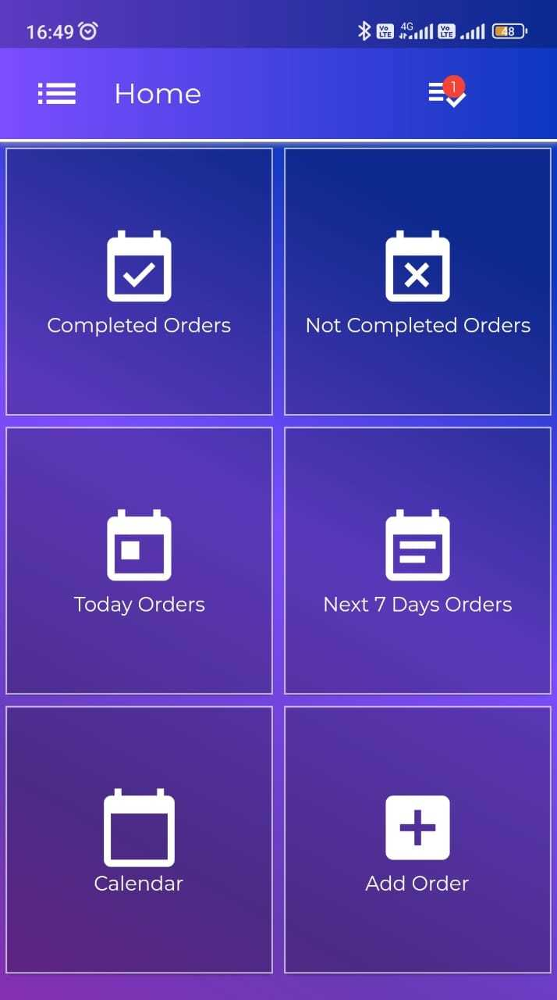
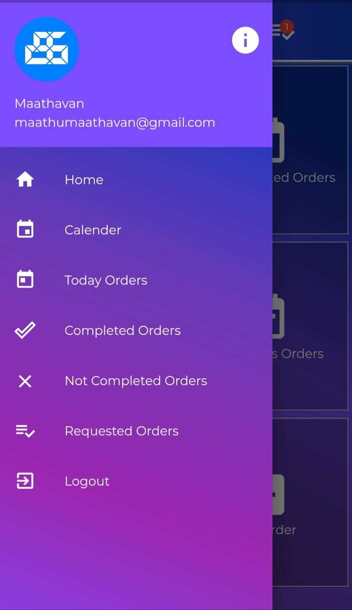
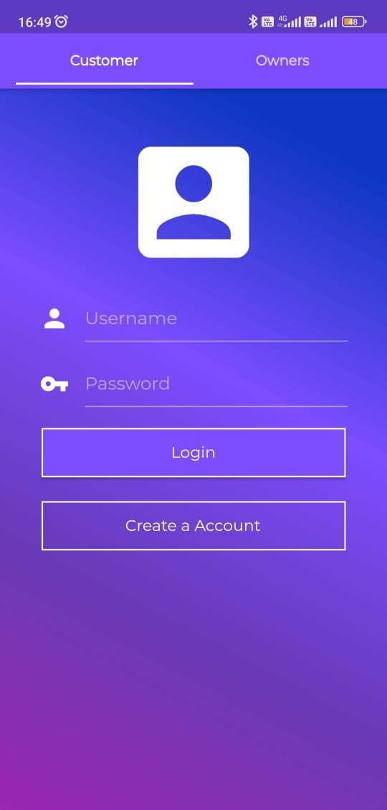
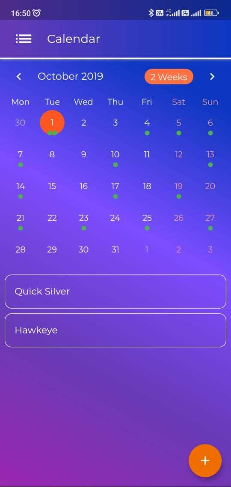
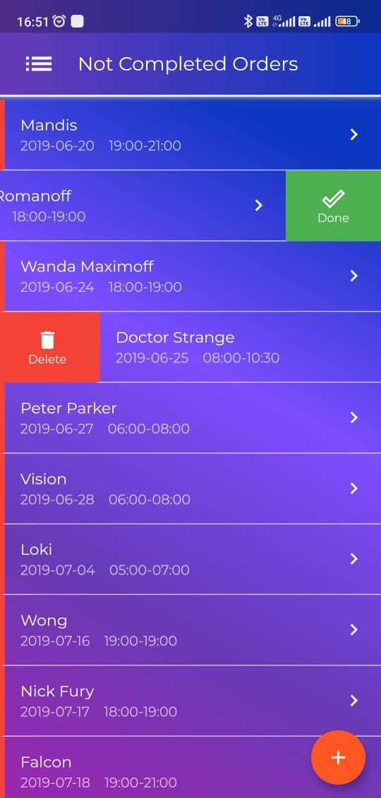

# Nikazhthi - Business Service Marketplace

[](https://flutter.dev/)
[](https://firebase.google.com/)
[](LICENSE)

## 📱 Overview

Nikazhthi is a comprehensive marketplace platform that connects businesses with customers through an efficient order management system. The app enables businesses to register their service centers, manage time slots, and receive automated reminders, while customers can easily search, book, and pay for services at their preferred business centers.

## ✨ Key Features

### 🏢 For Business Owners
- **Business Registration**: Register and manage your service center
- **Order Management**: Comprehensive system to handle customer orders
- **Time Slot Management**: Create and manage available time slots
- **Calendar Integration**: Visual calendar interface for order scheduling
- **Automated Reminders**: Get notifications before scheduled appointments
- **Order Status Tracking**: Monitor pending, completed, and upcoming orders
- **Customer Management**: View and manage customer requests

### 👥 For Customers
- **Service Discovery**: Search and browse available business centers
- **Easy Booking**: Book services in preferred time slots

- **Order Tracking**: Monitor your service requests
- **Reminder System**: Receive notifications about upcoming appointments
- **Business Reviews**: View business information and ratings

### 🔧 Core Functionality
- **Marketplace**: Connect customers with service providers
- **Order Management**: Complete order lifecycle management

- **Notification System**: Automated reminders and updates
- **Real-time Updates**: Live order status and availability

## 🛠 Technology Stack

- **Frontend**: Flutter (Cross-platform mobile development)
- **Backend**: Firebase Firestore (NoSQL database)
- **Authentication**: Firebase Authentication
- **Storage**: Firebase Storage
- **Notifications**: Flutter Local Notifications
- **State Management**: Shared Preferences
- **UI Components**: Material Design & Cupertino

## 📱 Screenshots

<div align="center">
  
  
  <br/>
  
  
  
</div>


## 🚀 Getting Started

### Prerequisites

- Flutter SDK (2.0 or higher)
- Dart SDK
- Android Studio / VS Code
- Firebase project setup
- Android/iOS development environment

### Installation

1. **Clone the repository**
   ```bash
   git clone https://github.com/yourusername/nikazhthi.git
   cd nikazhthi
   ```

2. **Install dependencies**
   ```bash
   flutter pub get
   ```

3. **Firebase Setup**
   - Create a new Firebase project
   - Enable Firestore Database
   - Enable Authentication
   - Enable Storage
   - Download and add `google-services.json` to `android/app/`
   - Configure iOS Firebase settings

4. **Run the app**
   ```bash
   flutter run
   ```

## 📁 Project Structure

```
lib/
├── main.dart                 # App entry point
├── sidedrawer.dart          # Navigation drawer
├── Login/                   # Authentication modules
│   ├── login.dart          # Business owner login
│   ├── mlogin.dart         # Main login with tabs
│   └── signup.dart         # Registration
├── Customer/               # Customer-facing features
│   ├── clogin.dart         # Customer login
│   ├── csignup.dart        # Customer registration
│   ├── Search.dart         # Business search
│   ├── req_order.dart      # Order requests
│   └── ucalender.dart      # Customer calendar
├── Project/                # Business owner features
│   ├── home.dart           # Business dashboard
│   ├── add_order.dart      # Add new orders
│   ├── calender.dart       # Order calendar
│   ├── requests.dart       # Customer requests
│   ├── order.dart          # Order management
│   └── today.dart          # Today's orders
└── Test/                   # Testing modules
```

## 🔧 Configuration

### Firebase Configuration

1. **Firestore Rules**
   ```javascript
   rules_version = '2';
   service cloud.firestore {
     match /databases/{database}/documents {
       // Add your security rules here
     }
   }
   ```

2. **Authentication Setup**
   - Enable Email/Password authentication
   - Configure user roles (Customer/Business Owner)

### Environment Variables

Create a `.env` file in the root directory:
```env
FIREBASE_PROJECT_ID=your-project-id
FIREBASE_API_KEY=your-api-key
```

## 📊 Database Schema

### Collections

- **users**: User profiles and authentication data
- **businesses**: Business center information
- **orders**: Order details and status
- **time_slots**: Available booking slots
- **notifications**: Reminder and notification data

## 🎨 UI/UX Features

- **Dark Theme**: Modern dark theme with purple accent colors
- **Gradient Backgrounds**: Beautiful gradient designs
- **Responsive Design**: Optimized for various screen sizes
- **Material Design**: Following Google's Material Design guidelines
- **Custom Fonts**: Montserrat font family for better readability

## 🔔 Notification System

The app includes a comprehensive notification system:
- **Local Notifications**: For order reminders
- **Push Notifications**: For real-time updates
- **Scheduled Reminders**: Automated appointment reminders


## 🧪 Testing

```bash
# Run unit tests
flutter test

# Run integration tests
flutter drive --target=test_driver/app.dart
```

## 📦 Building for Production

### Android
```bash
flutter build apk --release
```

### iOS
```bash
flutter build ios --release
```

## 📝 License

This project is licensed under the MIT License - see the [LICENSE](LICENSE) file for details.


**Made with ❤️ using Flutter & Firebase**
